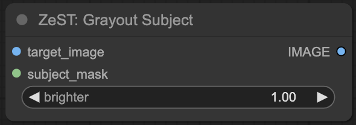
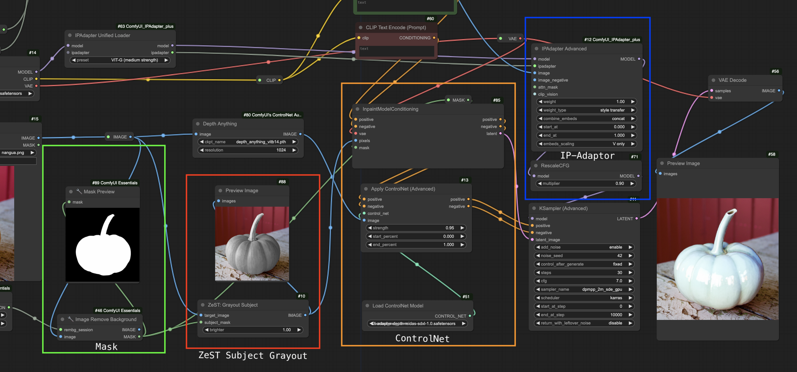

# ComfyUI-ZeroShot-MTrans: Zero-Shot Material Transfer from a Single Image

[中文](README_CN.md)

An unofficial ComfyUI custom node for [ZeST(Zero-Shot Material Transfer from a Single Image)](https://github.com/ttchengab/zest_code/)


Given an input image (e.g., a photo of an apple) and a single material exemplar image (e.g., a golden bowl), ZeST can transfer the gold material from the exemplar onto the apple with accurate lighting cues while making everything else consistent.

## install

in `ComfyUI Manager` or git clone to `ComfyUI/custom_nodes`

After restart `ComfyUI`, the following custom node will be available.



## dependences

- ControlNet
- IP-Adaptor
- Segment Anything Model

## Input/Output

- INPUT: 
  - `target_image` : the original image for inpaint
  - `subject_mask` : the `mask` for inpaint, this `mask` will be also used as input of `inpaint` node
  - `brighter` : default is 1, means no change
    - value < 1 , means darker the subject, useful when subject in high light
    - value >  1, means brighter the subject, useful when subject in dark light
    - tips: make sure the output subject is in `middle grey`.

- OUTPUT:
  - `IMAGE` : image with `subject` in luminosity(grey) mode. used as input for `inpaint` node

## Workflow 



### Image Input


### Material Input


### Temp Images

#### Mask


#### Subject Grayout


### Output


# Thanks to

- [ZeST: Zero-Shot Material Transfer from a Single Image Paper](https://arxiv.org/abs/2404.06425)
- [ZeST official DEMO](https://github.com/ttchengab/zest_code/)
- [ZeST site](https://ttchengab.github.io/zest/)
- [ZeST official video](https://www.youtube.com/watch?v=atG1VvgeG_g)

```bibtex
@article{cheng2024zest,
  title={ZeST: Zero-Shot Material Transfer from a Single Image},
  author={Cheng, Ta-Ying and Sharma, Prafull and Markham, Andrew and Trigoni, Niki and Jampani, Varun},
  journal={arXiv preprint arXiv:2404.06425},
  year={2024}
}
``` 