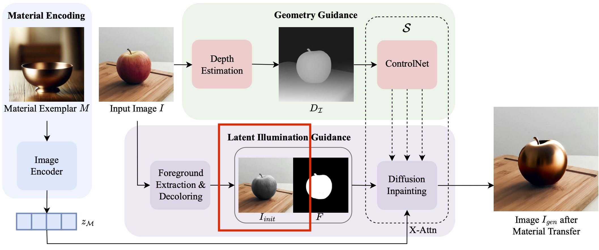
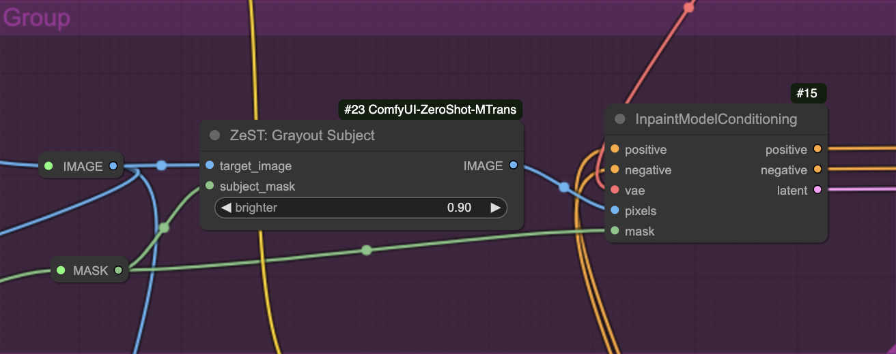

# ComfyUI-ZeroShot-MTrans: Zero-Shot Material Transfer from a Single Image

[中文](README_CN.md)

An unofficial ComfyUI custom node for [ZeST(Zero-Shot Material Transfer from a Single Image)](https://github.com/ttchengab/zest_code/)



Given an input image (e.g., a photo of an apple) and a single material exemplar image (e.g., a golden bowl), ZeST can transfer the gold material from the exemplar onto the apple with accurate lighting cues while making everything else consistent.

## Explains

The original demo code use IPA to extract the style of material, and control for depth information. Then, change the original image with illumination informaion of subject for better lighting style.

This node implementation the [illumination transfer](https://github.com/ttchengab/zest_code/blob/main/demo_gradio.py#L127), and make it an ComfyUI node. You can use any IPA and controlnet node as your wish.

This node implenment the red rect area of paper figure. For quickly start, you can refer to [zest_workflow.json](zest_workflow.json) in this repo.

## install

in `ComfyUI Manager` or git clone to `ComfyUI/custom_nodes`

After restart `ComfyUI`, the following custom node will be available.


## dependences

- ControlNet
- IP-Adaptor
- Segment Anything Model

## Input/Output

- INPUT: 
  - `target_image` : the original image for inpaint
  - `subject_mask` : the `mask` for inpaint, this `mask` will be also used as input of `inpaint` node
  - `brighter` : default is 1, means no change
    - value < 1 , means darker the subject, useful when subject in high light
    - value >  1, means brighter the subject, useful when subject in dark light

- OUTPUT:
  - `IMAGE` : image with `subject` in luminosity(grey) mode. used as input for `inpaint` node

### Tips

1. for output, the subject in `middle grey` is prefered. for high light material, dark it; otherwise, brighter it.
2. for `material` image, suggest remove all backgroup, just keep the material you want.
3. use `IP-Adaptor` strength, `controlnet` strength, `brighter` to control the output 1st.


## Workflow 


You can download the [zest_workflow.json](zest_workflow.json) from this repo for quickly start.


### sample workflow



### Image Input


### Material Input


### Temp Images

#### Mask


#### Subject Grayout


### Output


# Thanks to

- [ZeST: Zero-Shot Material Transfer from a Single Image Paper](https://arxiv.org/abs/2404.06425)
- [ZeST official DEMO](https://github.com/ttchengab/zest_code/)
- [ZeST site](https://ttchengab.github.io/zest/)
- [ZeST official video](https://www.youtube.com/watch?v=atG1VvgeG_g)

```bibtex
@article{cheng2024zest,
  title={ZeST: Zero-Shot Material Transfer from a Single Image},
  author={Cheng, Ta-Ying and Sharma, Prafull and Markham, Andrew and Trigoni, Niki and Jampani, Varun},
  journal={arXiv preprint arXiv:2404.06425},
  year={2024}
}
``` 